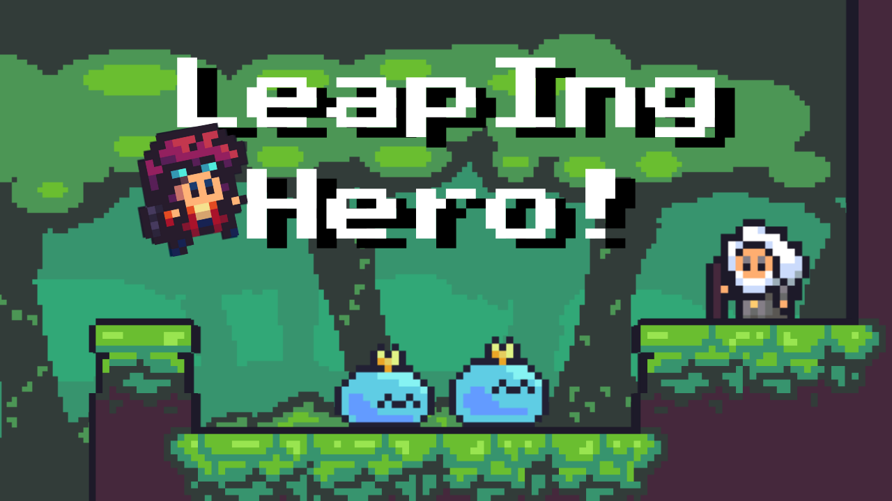
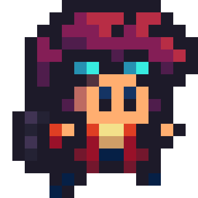

# 🧗‍♂️ Leaping Hero



**Leaping Hero** es un juego de aventuras protagonizado por un joven héroe que, al iniciar su travesía, se encuentra con un peculiar anciano que le pide ayuda para salvar su aldea de una invasión de slimes.

## 🎮 Sobre el juego

<p align="center">
  
</p>

- 🌍 El mundo de **Leaping Hero** está lleno de acción, plataformas y enemigos viscosos.
- 🧓 El anciano guía al héroe en su misión, desvelando secretos del pasado y los peligros que acechan.
- 💥 Combina mecánicas simples con una historia envolvente y combates dinámicos.

<p align="center">
  
</p>

## 🧑‍💻 Tecnologías utilizadas

Este repositorio contiene **dos versiones del juego**, cada una desarrollada con diferentes tecnologías:

### 🔹 Versión Web (JavaScript puro)

- Sin motores ni frameworks.
- Compatible con navegadores modernos.
- Diseño ligero y directo.
- Rama dedicada: [`web-version`](https://github.com/tuusuario/leaping-hero/tree/web-version)

### 🔸 Versión Unity

- Proyecto desarrollado con Unity.
- Gráficos mejorados, física y animaciones más avanzadas.
- Rama dedicada: [`unity-version`](https://github.com/tuusuario/leaping-hero/tree/unity-version)

> **Todos los assets, tanto gráficos como sonoros, son originales y creados por mí.**

## 🌱 Estructura de ramas

- `main`: Contiene ambos proyectos organizados por carpetas.
- `web-version`: Rama dedicada al desarrollo de la versión web en JavaScript.
- `unity-version`: Rama dedicada al desarrollo del proyecto en Unity.

## 🖥️ Cómo empezar

### Web

- **En Windows:**
  ```bash
  cd web
  start index.html
  
- **En macOS:**
  ```bash
  cd web
  open index.html

- **En Linux:**
  ```bash
  cd web
  xdg-open index.html

### Unity

> Proximamente en itch.io, puedes ir echando un vistazo a otros juegos publicados quicando  [`aqui`](https://dracoangie.itch.io)
